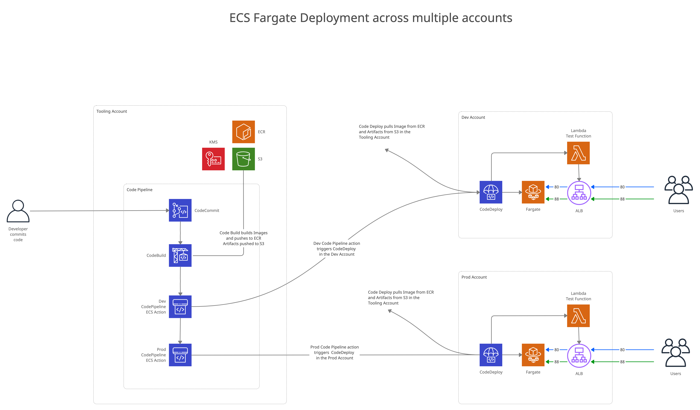

# ECS Fargate, CodePipeline, Blue/Green, Terraform, Multi Account

# Description

This project an example of how to use terraform to build and deploy an app into ECS Fargate across multiple AWS accounts with CodePipeline using blue green deployments.


<br>
# Setup

## 3 aws account are required. 
Create 3 AWS account, or use AWS Organisations to create 3 additional account.\
: dev\
: pord\
: tooling
<br><br>
## Deploy IAM roles in the dev/prod accounts

Due to dependency issues, first some roles need to be created in the dev/prod accounts before the tooling account can be created. 

- In terraform_ecs edit variables.tf and add your tooling accout id to "tooling_account" variable

- Login on the command line into the dev/prod accounts, repeat for each account

```
cd terraform_ecs/environment/<environment>
terraform init
terraform apply --target module.ecs.aws_iam_role.code_pipeline_cross_account_role \
    --target module.ecs.aws_iam_role.execution_role
```
<br><br>
## Deploy the tooling account

In terraform_tooling edit variables.tf and add the dev and prod accout ids to "dev_account_id" and "prod_account_id" variable

- Login on the command line into the tooling account
```
cd  terraform_tooling/environment/tooling 
terraform init
terraform apply
```
<br><br>
## Deploy the dev/prod accounts

- Login on the command line into the dev/prod accounts, repeat for each account
```
cd terraform_ecs/environment/<environment>
terraform init
terraform apply 
```
<br><br>
## Create a IAM user to commit code to CodeCommit

add the policy testproject2_codecommit_user_policy to the user permissions\
generate and download HTTPS Git credentials for AWS CodeCommit for the user
<br><br>
## Deploy the application 

```
cd simple_go
in buildspec.yaml edit the folling variables 
DEV_ACCOUNT_ID="<your dev account id>"
PROD_ACCOUNT_ID="<your prod account id>"
```

Using the credentials created above commit the contents of the simple_app directory into CodeCommit

............


